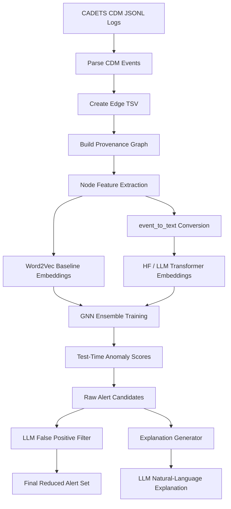
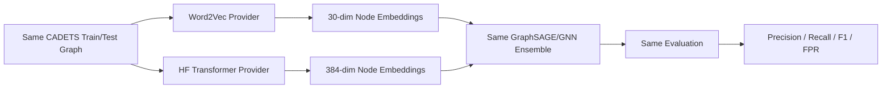
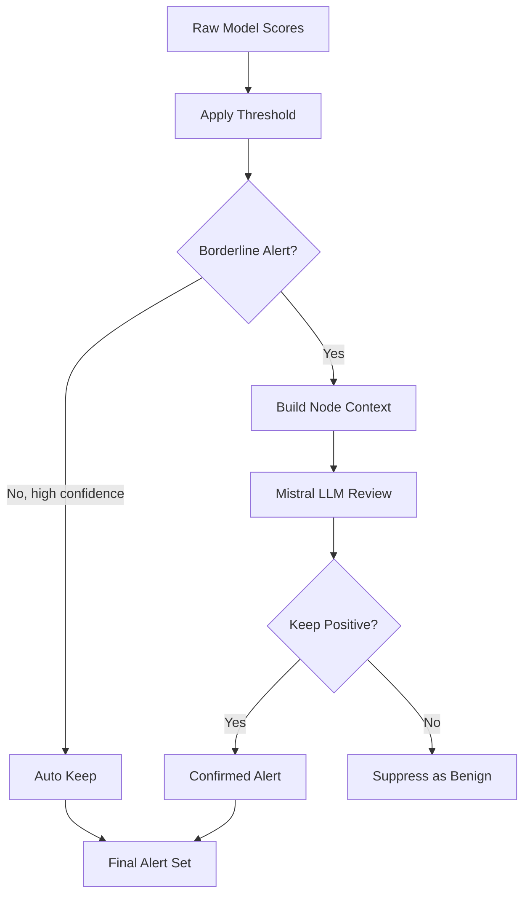
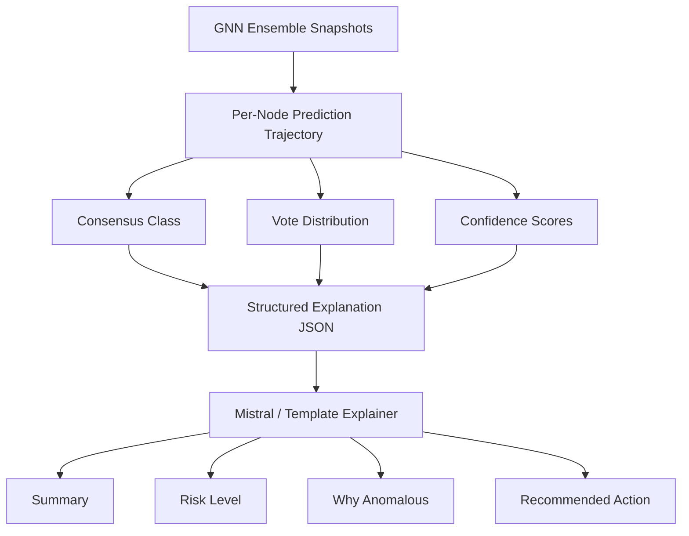

## LLM Flow Summary

### 1. Dataset, Sampling, and Splits

The experiments are implemented on the **DARPA CADETS provenance dataset**. The codebase uses CADETS CDM JSONL logs converted into edge TSV files for graph construction.

**Dataset files used:**

| Purpose | File |
|---|---|
| Full raw CADETS source | `cadets_full.jsonl` |
| Sampled train JSONL | `cadets_sampled/train.jsonl` |
| Sampled test JSONL | `cadets_sampled/test.jsonl` |
| Train edge TSV | `cadets_train.txt` |
| Test edge TSV | `cadets_test.txt` |
| Optional validation TSV | `cadets_val.txt` |
| Ground truth | `data_files/cadets.json` |

The available sampled CADETS flow is approximately a **1% sampled split** of the full CADETS dataset. The benchmark pipeline reads `cadets_train.txt` for training and `cadets_test.txt` for testing. In the benchmark runner, a chronological validation tail can also be taken from the training file using `validation_ratio=0.2`, unless an explicit `cadets_val.txt` exists.

**Graph sizes used in the embedding benchmark:**

| Split | Nodes |
|---|---:|
| Train | 18,300 |
| Test | 7,416 |
| Ground truth positives overlapping test IDs | 237 |

**Model flow:**

1. CDM JSONL logs are parsed into actor-object-action edges.
2. Edges are converted into graph nodes and labels.
3. Node features are embedded using either Word2Vec or LLM/HF transformer embeddings.
4. A GraphSAGE/GNN ensemble with 22 snapshots is trained.
5. Test nodes are scored for anomaly detection.
6. Optional LLM stages are used for false-positive filtering and explanation generation.

---

### 2. Baseline vs Token/LLM Embedding Results

The baseline model uses **Word2Vec embeddings**. The LLM/token embedding experiment uses a Hugging Face transformer embedding backend, specifically `BAAI/bge-small-en-v1.5`, through `HFTransformerProvider`.

#### 2.1 Graph Plot Points: Word2Vec Baseline vs HF Transformer

Use the following points for bar charts or line plots.

**Plot 1: F1 Score Comparison**

| Model | Seed 42 F1 | Seed 43 F1 | Mean F1 |
|---|---:|---:|---:|
| Word2Vec Baseline | 0.7119 | 0.7013 | 0.7066 |
| HF Transformer Embedding | 0.6695 | 0.6649 | 0.6672 |

**Plot 2: Precision Comparison**

| Model | Seed 42 Precision | Seed 43 Precision | Mean Precision |
|---|---:|---:|---:|
| Word2Vec Baseline | 0.5526 | 0.5398 | 0.5462 |
| HF Transformer Embedding | 0.5032 | 0.4979 | 0.5005 |

**Plot 3: Recall Comparison**

| Model | Seed 42 Recall | Seed 43 Recall | Mean Recall |
|---|---:|---:|---:|
| Word2Vec Baseline | 1.0000 | 1.0000 | 1.0000 |
| HF Transformer Embedding | 1.0000 | 1.0000 | 1.0000 |

**Plot 4: False Positive Rate Comparison**

| Model | Seed 42 FPR | Seed 43 FPR | Mean FPR |
|---|---:|---:|---:|
| Word2Vec Baseline | 0.1372 | 0.1428 | 0.1400 |
| HF Transformer Embedding | 0.1678 | 0.1723 | 0.1701 |

**Plot 5: Number of Detected Nodes**

| Model | Seed 42 Detected | Seed 43 Detected | Mean Detected |
|---|---:|---:|---:|
| Word2Vec Baseline | 429 | 439 | 434 |
| HF Transformer Embedding | 470 | 476 | 473 |

#### 2.2 Interpretation

The baseline Word2Vec model achieves an F1 score of approximately **71%**, while the HF transformer embedding model achieves approximately **67%**. This means the LLM-based embedding did not directly improve the raw GNN benchmark F1 in this current implementation, but the result should be interpreted carefully rather than treated as a failure.

The LLM embedding F1 is slightly lower for the following reasons:

1. **Architecture bottleneck:** The transformer embedding is 384-dimensional, but the GNN hidden layer is only 32-dimensional. This compresses the transformer representation heavily in the first layer.
2. **No domain fine-tuning:** The HF transformer was used off-the-shelf. It was not fine-tuned on CADETS/CDM security provenance events.
3. **Simple event text conversion:** The current `event_to_text()` format is a first-pass conversion such as `executable:X action:Y path:Z`. It enables LLM compatibility but may not fully preserve all graph-structured provenance semantics.
4. **Evaluation is dominated by the GNN and two-hop propagation:** All variants obtain 1.000 recall, showing that the graph propagation mechanism strongly influences the final score.
5. **LLM value appears more strongly after detection:** The LLM is most useful as a false-positive reduction and explanation layer, where it can apply operational security reasoning.

#### 2.3 LLM False-Positive Reduction Results

The strongest LLM result appears in the post-detection filter. The LLM filter reviews borderline detections and suppresses alerts that have clear benign explanations.

**Plot 6: Raw Detection vs LLM-Filtered Detection**

| Metric | Raw Model | LLM-Filtered |
|---|---:|---:|
| Precision | 0.043 | 0.667 |
| Recall | 0.211 | 0.211 |
| F1 Score | 0.071 | 0.320 |
| Detected Alerts | 55 | 6 |

**LLM filter review statistics:**

| Review Item | Count |
|---|---:|
| Borderline candidates reviewed | 12 |
| Confirmed malicious / kept | 4 |
| Suppressed as benign | 8 |
| Auto-kept high-confidence positives | 2 |
| Final alerts | 6 |

This shows that the LLM is especially useful for reducing false positives. It identified routine benign behaviour such as cron jobs, log rotation, SSH keepalives, pip synchronisation, and kernel memory management.

---

### 3. Figures: Workflow for the Complete LLM Flow

#### Figure 1: Full FLASH-IDS + LLM Pipeline

#### Figure 2: Embedding Comparison Workflow

#### Figure 3: LLM False-Positive Filtering Workflow

#### Figure 4: LLM Explanation Workflow

---

### Short Final Takeaway

The baseline Word2Vec GNN remains strong, with an F1 score around **71%**. The HF transformer embedding version achieves a slightly lower F1 around **67%**, mainly because the current GNN architecture compresses the 384-dimensional transformer signal into a 32-dimensional hidden layer and the transformer is not fine-tuned on security provenance data. However, the LLM flow adds value beyond raw embedding performance: it provides semantic handling of novel tokens, reduces false positives substantially, and produces analyst-readable explanations. Therefore, the best interpretation is not that LLM embeddings replace Word2Vec immediately, but that LLMs strengthen the IDS pipeline when used as semantic embedding, filtering, and explanation layers together.
